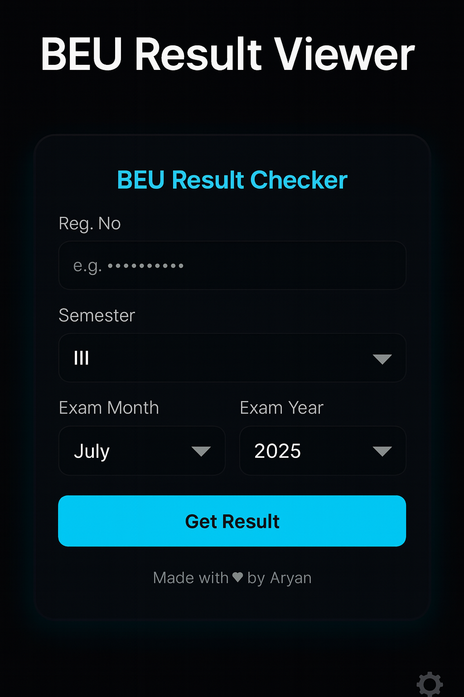

# BEU Result Viewer

A clean and fast result viewer for Bihar Engineering University (BEU) students.  
This project allows students to check their semester results instantly just by entering:

- Registration Number  
- Semester  
- Exam Month & Year  

The interface is fully responsive, AMOLED-friendly, and optimized for mobile users.

---

## 🔥 Features
- Instant BEU result fetch  
- Dark AMOLED themed UI  
- Dropdown for Semester, Month, Year  
- Auto-formatted result viewer  
- Secure API handling  
- Made in JavaScript + HTML + Vercel serverless functions  
- Designed for speed and simplicity  

---

## 📸 Preview

---

## 🚀 Deployments
This project is fully hosted using:

- **GitHub Pages / Vercel** for the frontend  
- **Vercel Serverless Function** (`result.js`) for backend API proxy  

---

## 🛠️ Tech Stack
- HTML  
- CSS (custom UI)  
- JavaScript  
- Vercel Serverless Functions  
- GitHub Hosting  

---

## ✨ Author
Made with ❤️ by **Aryan Chaudhary**
